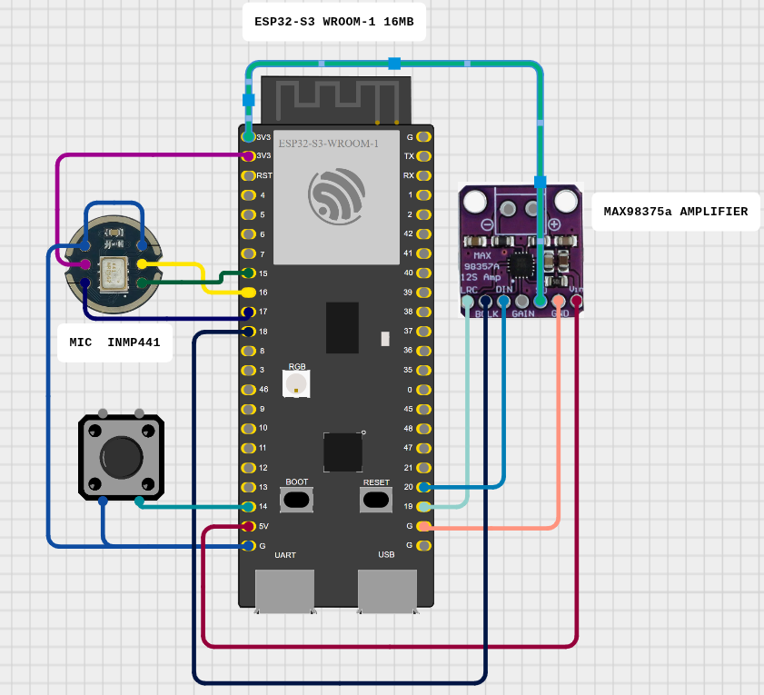

# ESP32-S3 I²S Recorder / Player


This project shows how to record audio from an **INMP441** MEMS microphone and play it back through a **MAX98357A** Class‑D amplifier using an **ESP32‑S3 DevKitC‑1**.  
A single push‑button starts/stops recording; the on‑board LED indicates status.



---

## 1. Hardware Used

| Item   | Details                                                         |
|--------|-----------------------------------------------------------------|
| MCU    | ESP32‑S3 DevKitC‑1 (module **ESP32‑S3‑WROOM‑1‑N16**, 16 MB Flash) |
| Mic    | INMP441 I²S MEMS microphone breakout                            |
| Amp    | MAX98357A I²S 3 W audio amplifier breakout                       |
| Control| Momentary push‑button (GPIO14 → GND)                            |
| LED    | On‑board RGB LED (GPIO38)                                       |

---

## 2. Wiring

| Function     | ESP32‑S3 GPIO | INMP441 | MAX98357A | Notes                                |
|--------------|---------------|---------|-----------|--------------------------------------|
| 3.3 V        | 3V3           | VIN     | VIN       | Common supply                        |
| GND          | GND           | GND     | GND       | Common ground                        |
| **BCLK Rx**  | **15**        | SCK     | –         | Mic bit‑clock                        |
| **WS Rx**    | **16**        | WS/LR   | –         | Mic word‑select                      |
| **DATA IN**  | **17**        | SD      | –         | Mic → MCU                            |
| **BCLK Tx**  | **18**        | –       | BCLK      | Amp bit‑clock                        |
| **WS Tx**    | **19**        | –       | LRC       | Amp word‑select                      |
| **DATA OUT** | **20**        | –       | DIN       | MCU → Amp                            |
| L/R Select   | —             | L/R→GND | –         | Mono (Left)                          |
| Enable (SD)  | —             | –       | SD/EN→3V3 | Amp always on                        |
| Gain         | —             | –       | GAIN→3V3 / GND / float | 12 dB / 6 dB / 9 dB |
| Button       | **14**        | –       | –         | Between GPIO14 & GND (INPUT_PULLUP)  |
| LED          | **38**        | –       | –         | Built‑in LED                         |

---

## 3. Firmware Layout

```
include/
  main.h   – global definitions (GPIOs, sample‑rate)
  mic.h    – I²S RX API (pure C)
  audio.h  – I²S TX API (pure C)
src/
  main.c– Arduino sketch (C)
  mic.c    – microphone driver (C)
  audio.c  – amplifier driver (C)
```

### Key Libraries / Headers

* **Arduino‑core** (`Arduino.h`) – GPIO, Serial, timing.
* **ESP‑IDF HAL** (`driver/i2s.h`) – I²S peripheral access.
* `esp_heap_caps.h` – heap‑capable SRAM allocation.

---

## 4 Runtime Parameters (default)

* `SAMPLE_RATE` = 8000 Hz  
* `REC_SECONDS` = 4 s (→ 64 kB buffer in internal SRAM)

> Using a module **with PSRAM** (e.g. ESP32‑S3‑WROOM‑1‑N8R8) you can raise both values (10 s @ 16 kHz ≈ 320 kB).

---

## 5. Build & Flash

```bash
pio run -t upload      # build & flash
pio device monitor     # open serial monitor
```

Serial log on reset:

```
Ready
Heap free: … B
Recording…
Playing…
```

---

## 6. Behaviour Flow

1. **IDLE** – LED off, waiting for button.  
2. **RECORD** – LED on, capture until 4 s or second press.  
3. **Delay** – 1 s pause.  
4. **PLAYBACK** – LED off, buffer sent to amp.  
5. Loop back to **IDLE**.

---

## 7. Extension Ideas

* Switch to PSRAM module for higher quality/longer clips.  
* Implement software volume scaling or AGC.  
* Save WAV to SD or SPIFFS.  
* Add OTA update & WebSerial streaming.

---


# Hello World for Goiaba Board

A minimal **Hello World** example for the Goiaba Board. This demo shows basic UART output and FreeRTOS task setup as a foundation for more advanced AIoT applications.

## Key Features

* **UART Hello**: Prints a “Hello, World! I’m Goiaba!” message over UART once per second.
* **FreeRTOS Task**: Illustrates how to spawn and schedule a periodic task.
* **ESP-IDF Workflow**: Provides a Makefile wrapper (or use `idf.py`) for build, flash, monitor commands.

## Prerequisites

* **Goiaba Platform** connected via USB.
* **ESP-IDF v5.x** installed and configured (`IDF_PATH` environment variable).
* **Python 3** (via ESP-IDF virtual environment or system installation).

## Project Structure

```text
.
├── Makefile             ← Convenience wrapper around idf.py
├── .gitignore           ← Files and folders to ignore in Git
├── README.md            ← This file
├── sdkconfig.defaults   ← Default ESP-IDF config options
└── main
    └── hello_world_main.c  ← Example application code
```

## Quick Start

```bash
# 1. (Once) Set up environment
make setup

# 2. Build firmware
make build

# 3. Flash to device
make flash

# 4. Monitor UART (115200 baud)
make monitor
```

Press **Ctrl+]** to exit the serial monitor.

## 9. License

MIT – see `LICENSE`.
